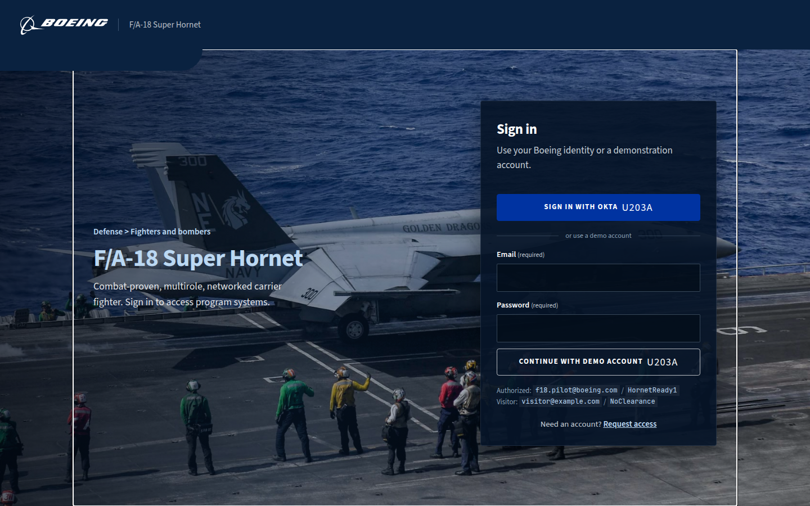
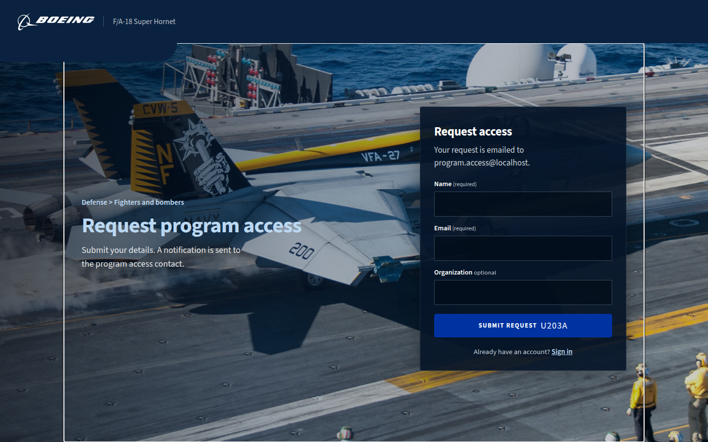
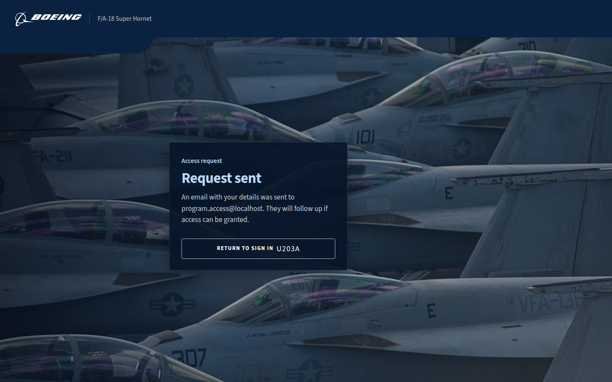
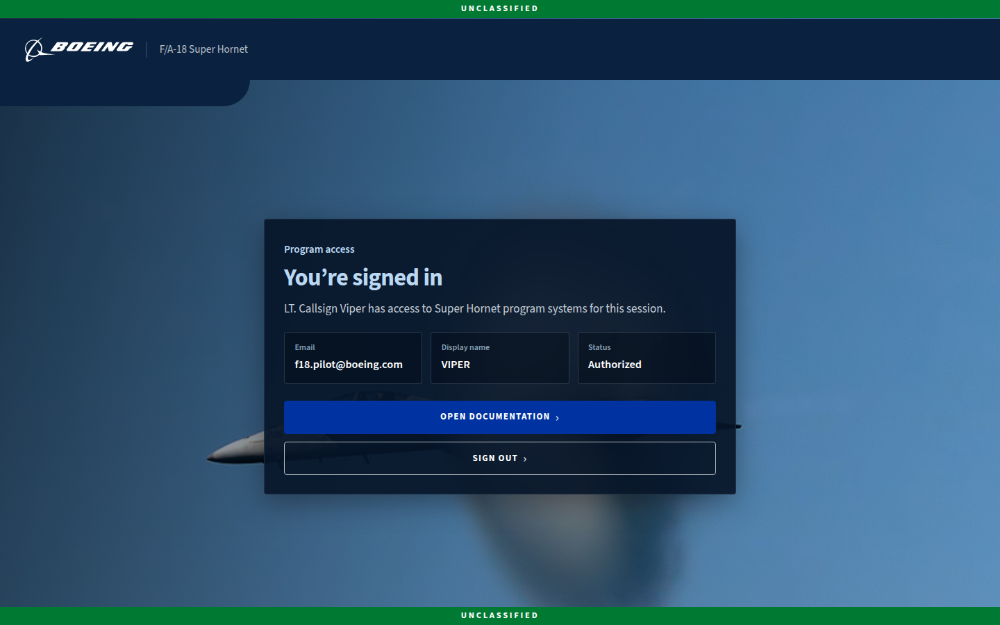
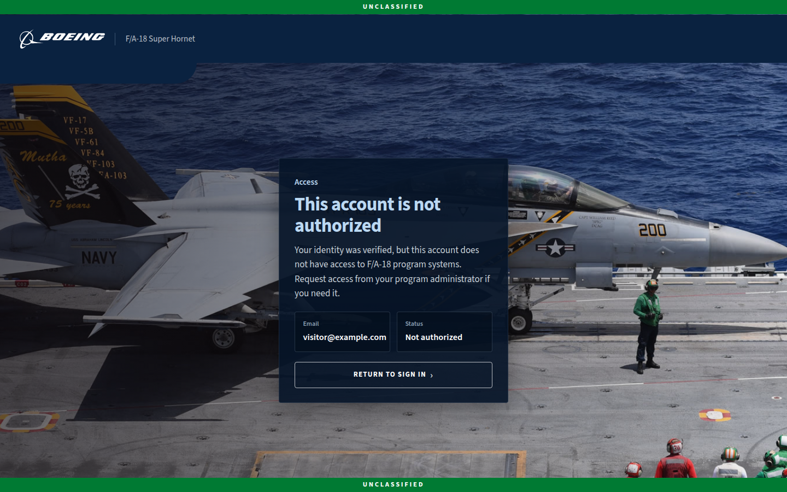
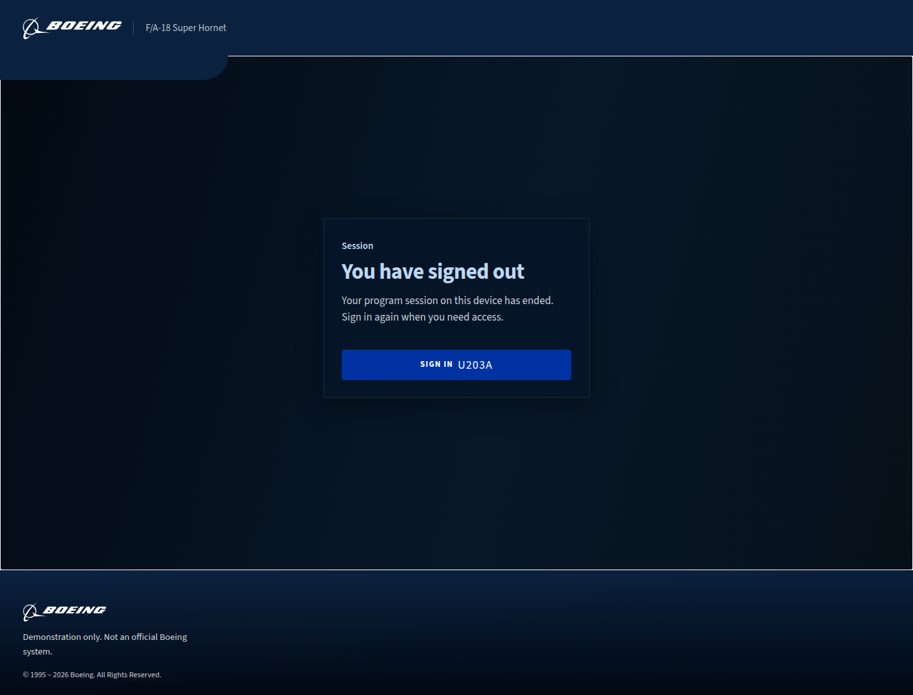
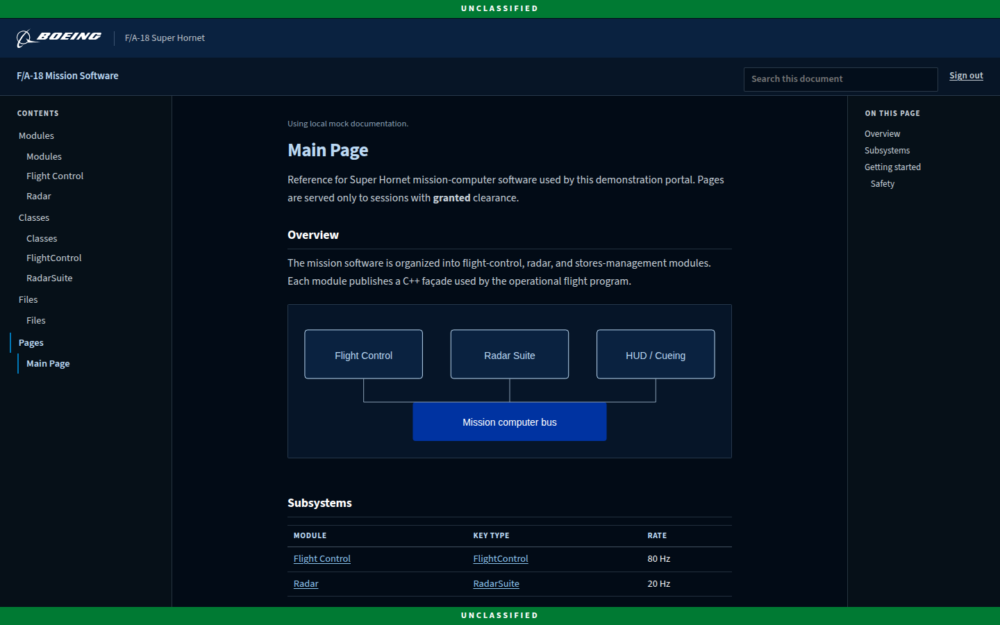

# F/A-18 Program Access Portal

Boeing-branded demonstration. Flask API plus a React/Vite SPA. Mock Okta only
(no live tenant). Not an official Boeing system.

## Demo accounts

- Granted: `f18.pilot@boeing.com` / `HornetReady1` — session clearance granted, then `/docs`.
- Denied: `visitor@example.com` / `NoClearance` — login still completes (HTTP 200 + session); clearance is denied and the SPA goes to `/denied`.
- Wrong password: HTTP 401 and the login error banner. No session.

Denied is a completed login. `GET /api/auth/me` returns `clearance: denied`.

## Routes

- `/` and `/login` — sign in (Okta hop or demo form)
- `/signup` — request access
- `/signup-sent` — request accepted
- `/success` — granted landing (also reachable after login)
- `/docs` — auth-gated Doxygen reader (granted sessions only)
- `/denied` — signed in, no clearance
- `/logged-out` — session cleared

Header chrome is the mark plus program name. Footer is the mark, the demo line, and copyright. There is no flying Hornet animation, no flyout help, and no DocsHero photo band.

## Screenshots

Current clean portal surfaces (no flyouts, no flying Hornet, no DocsHero):

### Sign in (`/` / `/login`)

### Request access (`/signup`)

### Request sent (`/signup-sent`)

### Signed in (`/success`)

### Not authorized (`/denied`)

### Signed out (`/logged-out`)

### Documentation (`/docs`)

## How to run Flask + Vite

1. Copy `backend/.env.example` to `backend/.env` if you need local overrides. Do not commit `.env`. Leave `OKTA_ISSUER` empty for the mock IdP.
2. Backend: `python -m pip install -r backend/requirements.txt` then `python backend/app.py` (port 5000).
3. Frontend: in `frontend`, install dependencies and run `npm run dev` (Vite on port 5173, proxies `/api` to Flask).
4. Optional: `npm run build` in `frontend` so Flask can serve `frontend/dist` on port 5000 alone.

## Environment

Only `backend/.env.example` is tracked. Secrets and mailbox dumps stay local (see `.gitignore`).

Signup without `SMTP_HOST` writes a `.eml` under `backend/mailbox/`. `GET /api/copy` serves `backend/copy.json` (plus `COPY_*` overlays) and `classification` `{level, text, color, ink, disclaimer}`.

Granted sessions read Doxygen HTML at `/docs` through `/api/docs/*`. Unset S3 vars to serve `backend/doxygen-mock/html`.

### Variables

Mock Okta (leave `OKTA_ISSUER` empty):

- `OKTA_ISSUER` — empty = mock IdP; set only if you point at a real issuer
- `OKTA_CLIENT_ID` / `OKTA_CLIENT_SECRET` / `OKTA_REDIRECT_URI`
- `FLASK_SECRET` / `FLASK_DEBUG`

Signup:

- `SIGNUP_NOTIFY_EMAIL` (default `program.access@localhost`)
- `SIGNUP_FROM_EMAIL`
- `SMTP_HOST` / `SMTP_PORT` / `SMTP_USER` / `SMTP_PASSWORD` / `SMTP_STARTTLS` — unset host writes `backend/mailbox/*.eml`

Doxygen (`/docs` via `/api/docs/*`; no live S3 required):

- unset all `S3_DOXYGEN_*` → `backend/doxygen-mock/html`
- `S3_DOXYGEN_BASE_URL` — public prefix (wins)
- `S3_DOXYGEN_BUCKET` / `S3_DOXYGEN_PREFIX` / `S3_DOXYGEN_REGION` — private bucket

Copy overlays:

- `COPY_<SECTION>_<KEY>` e.g. `COPY_LOGIN_TITLE`
- `COPY_FILE` — alternate catalog path

Classification banner (display-only; copy root `.env.example` to `.env`):

- `CLASSIFICATION` — same key as the GitLab CI/CD dropdown. Options: `UNCLASSIFIED` (default), `CUI`, `CONFIDENTIAL`, `SECRET`, `TOP SECRET`, `ITAR`, `CUSTOM`
- `CLASSIFICATION_TEXT` — optional override for the banner words on any level
- `CLASSIFICATION_CUSTOM_TEXT` / `CLASSIFICATION_CUSTOM_COLOR` — used when `CLASSIFICATION=CUSTOM`
- This is a label. It is not an ATO or a claim the demo can hold CUI or classified.
- `GET /api/copy` How: catalog + `notifyEmail` + `classification` `{level, text, color, ink, disclaimer}`

## Checks and CI

`make check` is the fast local lint + five-part comment gate.

`make ci` is the portable product contract (also `scripts/pipeline.sh`): ruff, comments `--all`, pytest, frontend lint/test, frontend build.

GitHub Actions (`.github/workflows/ci.yml`) is the hosted pipeline. GitLab CI (`.gitlab-ci.yml`) uses the same contract — both call `make ci` / the pipeline script. A separate security workflow runs pip-audit and production high+ Node audit so advisory noise does not fail the product gate.

Actions: https://github.com/KRNichols/react-doxygen/actions

## API

Route-by-route request bodies, response JSON, and status codes are in
[docs/api.md](docs/api.md).

The portal session is the httpOnly `f18_session` cookie (SameSite=Lax,
eight-hour lifetime, `Secure` off in this demo), signed with `FLASK_SECRET`.
The SPA sends it on `/api/*` with `credentials: include`. A successful mock
login — granted or denied — sets the cookie; `GET /api/auth/me` then returns
`clearance: granted` or `clearance: denied`. No cookie is **401**.
Documentation routes additionally return **403** when the session exists but
clearance is not granted.
